# Alternatives CI used

## Circleci

###  Linking Github with Circleci

The first step is to go to the main [page of the platform](http://circleci.com).


We signed up with Github and authorized Circleci


We select which organization we are under (this is because a repository can be authorized by several users)


We see the list of available repositories and select **cloudbanking**
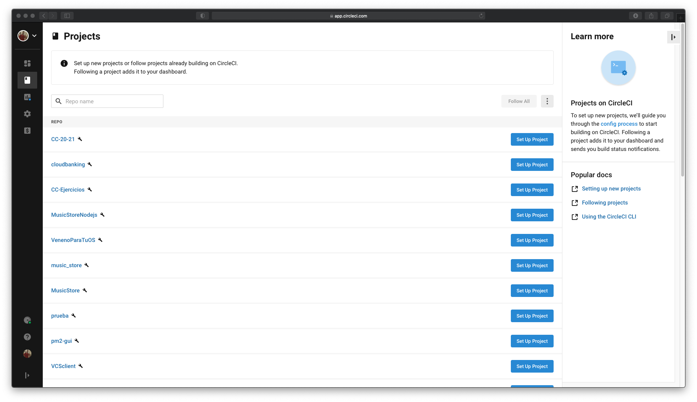

We leave the welcome file to check that the basic pipeline runs correctly, and then modify it to our needs.


We check that it runs correctly and become familiar with the Circleci interface


It is time to establish our own pipeline, to do so we modify the file `.circleci/config.yml`


The most current configuration file can be found in the repository [cloudbanking](https://github.com/pepitoenpeligro/cloudbanking/blob/master/.circleci/config.yml).

The historical moment of addition of this file and therefore its origin can be found in the commit [#8ec423d](https://github.com/pepitoenpeligro/cloudbanking/commit/8ec423d73c48ad5e112b6923bad68f91c0e1c5b9#diff-78a8a19706dbd2a4425dd72bdab0502ed7a2cef16365ab7030a5a0588927bf47)


```yaml
# Use the latest 2.1 version of CircleCI pipeline process engine. See: https://circleci.com/docs/2.0/configuration-reference
version: 2.1

jobs:
  build:
    docker:
      # Seleccting the same rust version of our Dockerfile.
      # Important for tokio and warp packages.
      - image: circleci/rust:1.48.0

    environment:
      # Changing TZ for correct testing of BankAccount and Card
      TZ: "/usr/share/zoneinfo/Europe/Madrid"

    steps:
      - checkout
      - restore_cache:
          # Recover a previous cache key (see -save_cache)
          key: cloudbanking-cache

      - run:
          name: List Compiler Version
          command: | 
            cargo --version && rustc --version
      - run:
          name: List dependencies in Cargo.lock
          command: |
            cargo generate-lockfile
      - run:
          # Calling cargo to execute all test
          name: Test cloudbanking
          command: |
            cargo test -- --nocapture
      - save_cache:
          # Saving cache in cache['cloudbanking-cache']
          # cache['cloudbanking-cache'][0] = "./target"
          # cache['cloudbanking-cache'][1] = "~/.cargo"
          # cache['cloudbanking-cache'][2] = "/usr/local/cargo/registry"
          key: cloudbanking-cache
          paths:
            - "./target"
            - "~/.cargo"
            - "/usr/local/cargo/registry"
```


### File explanation

We define a single phase of construction in which we define the execution of our environment on a docker image.
This docker image can be defined as a CircleCI image or a DockerHub image. In our case, we use a CircleCI own image because it facilitates the process of caching the dependencies and saves us time in each execution. Version 1.48 of rust is selected as the base container, making it coincide with the base version necessary for the execution of our project.

In this file we express in sequences the tasks to be performed. We start with a list of the rust compiler and package manager versions, then we generate the dependency file, and then we execute the tests.
This can be seen expressed in each **run** element that hangs from the **steps** element.

It's worth mentioning that we save the cache of our project's dependencies in a key called **cloudbanking-cache** that we retrieve before starting the next execution of the *pipeline*. 

A necessary issue for our project is to correctly configure the *TimeZone* since we use the *NaiveDateTime* data type that depends on the time zone of the running machine. This way, when it passes the date test, it will not give an error when matching what it expected (date and time based on Madrid as TZ). Nobody assures us that it will run on a machine with correct TZ (most likely it will be on a machine with TZ America configuration)

We make a change in the repository and complete with commit and push to launch the defined *pipeline*.

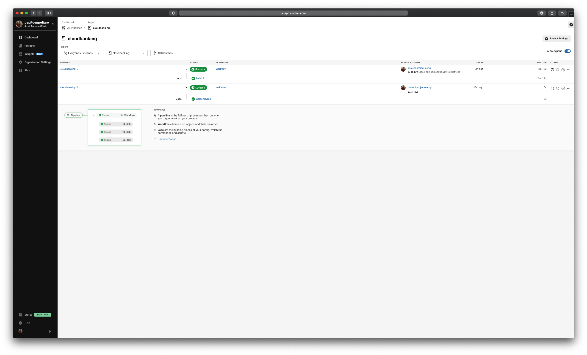

If we observe the details of the execution of the *pipeline* we can check that all the execution was correct, that the project passes the tests and that it is done as it is expressed in the CircleCI configuration file, that is, step by step, with the specific rust version, and saving the cache for the next execution

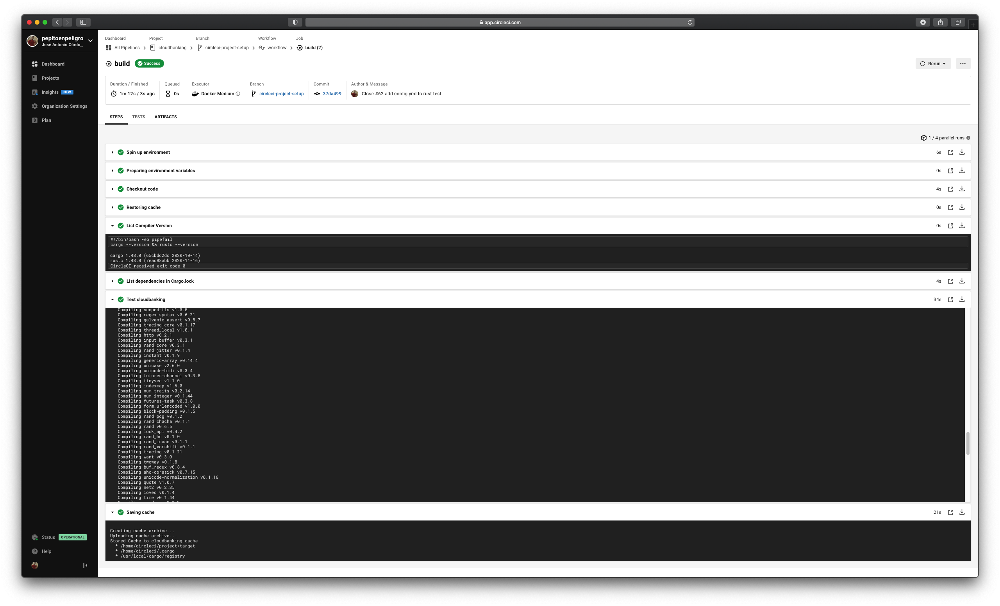

**CircleCI** : :heavy_check_mark:


## Drone.io

The first step is to go to the main [page of the platform](https://www.drone.io).
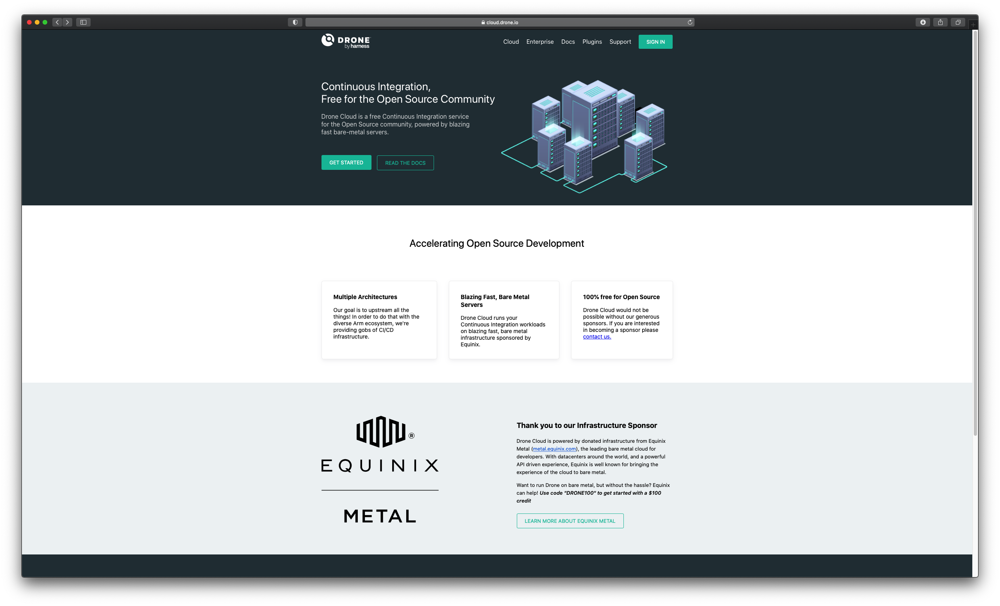

We signed up with Github and authorized Drone.io
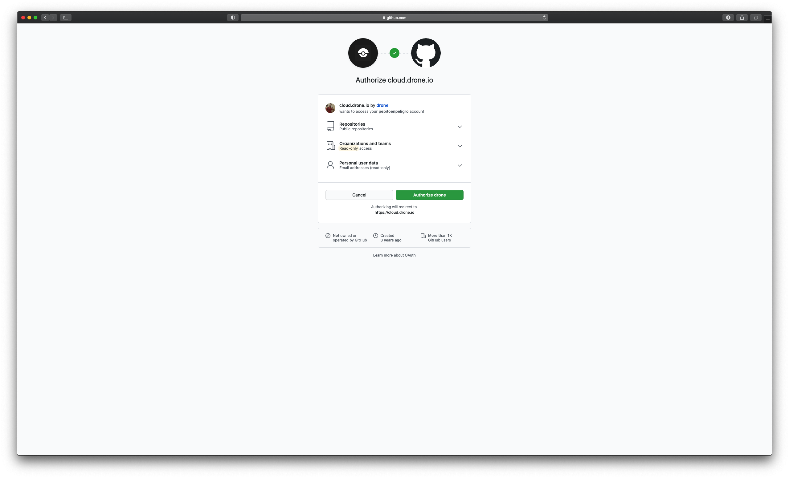


We see the list of available repositories and select **cloudbanking**
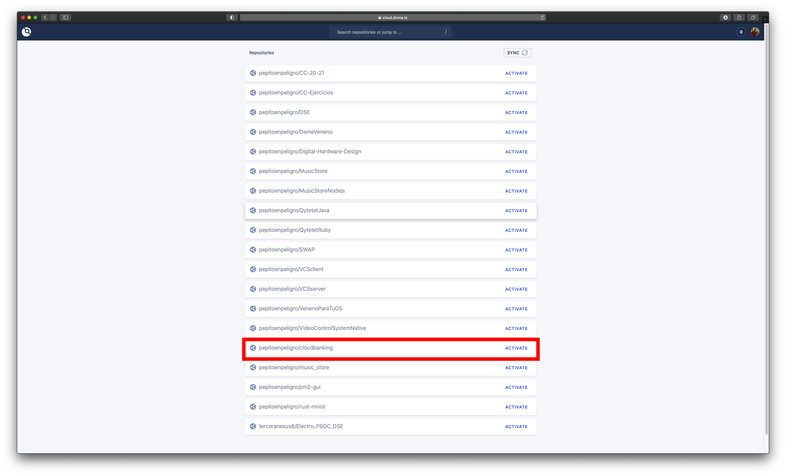

And activate the repo:

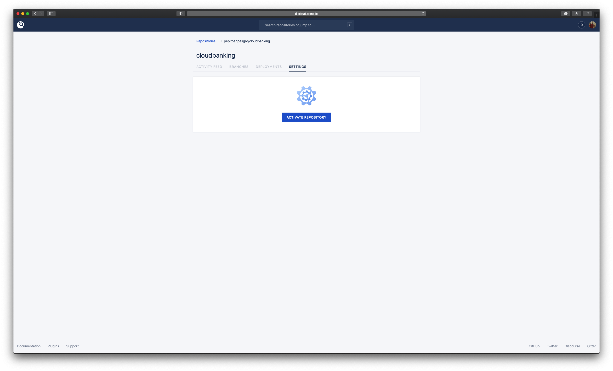

We should indicate which file will be read from drone.io:

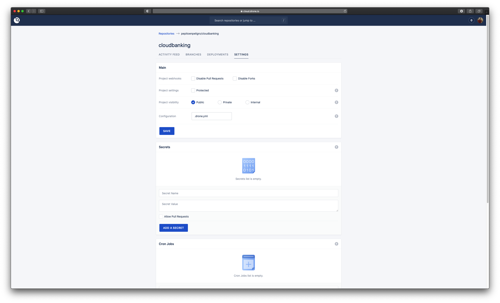

Now, it's time to define the pipeline:


```yaml
kind: pipeline
type: docker # Running into a docker container
name: default

steps:
  # Listing the cargo version and rustc version
- name: listversion # name of the step
  image: rust:1.48  # base image of running docker container
  commands: 
  - cargo --version && rustc --version

- name: test
  # Running the test
  image: rust:1.48 # base image of running docker container
  commands:
  - cargo test -- --nocapture
```

We perform a commit and push of the repo and then the execution of the *pipeline* appears:

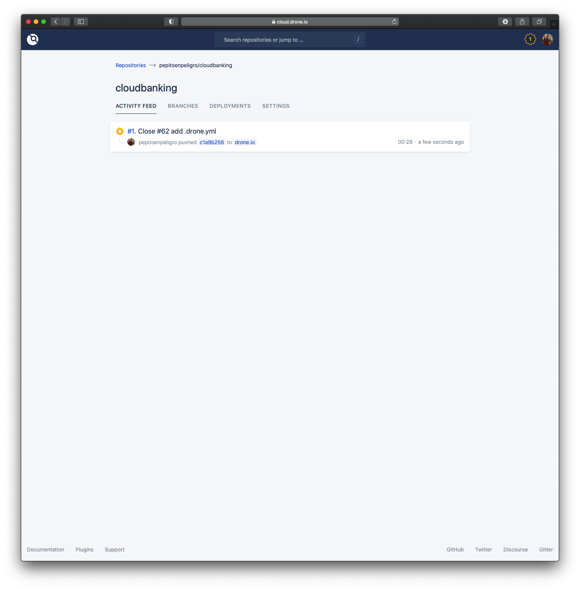
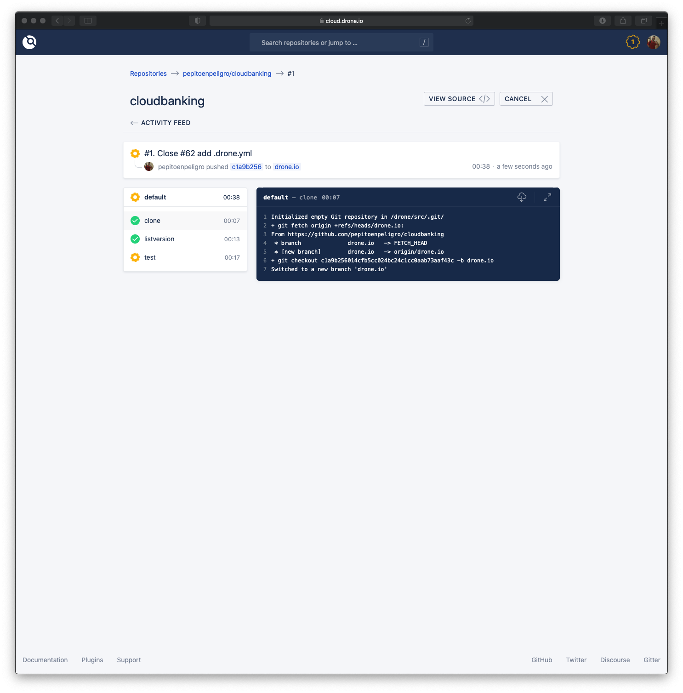

In drone.io we can see the result of each stage:


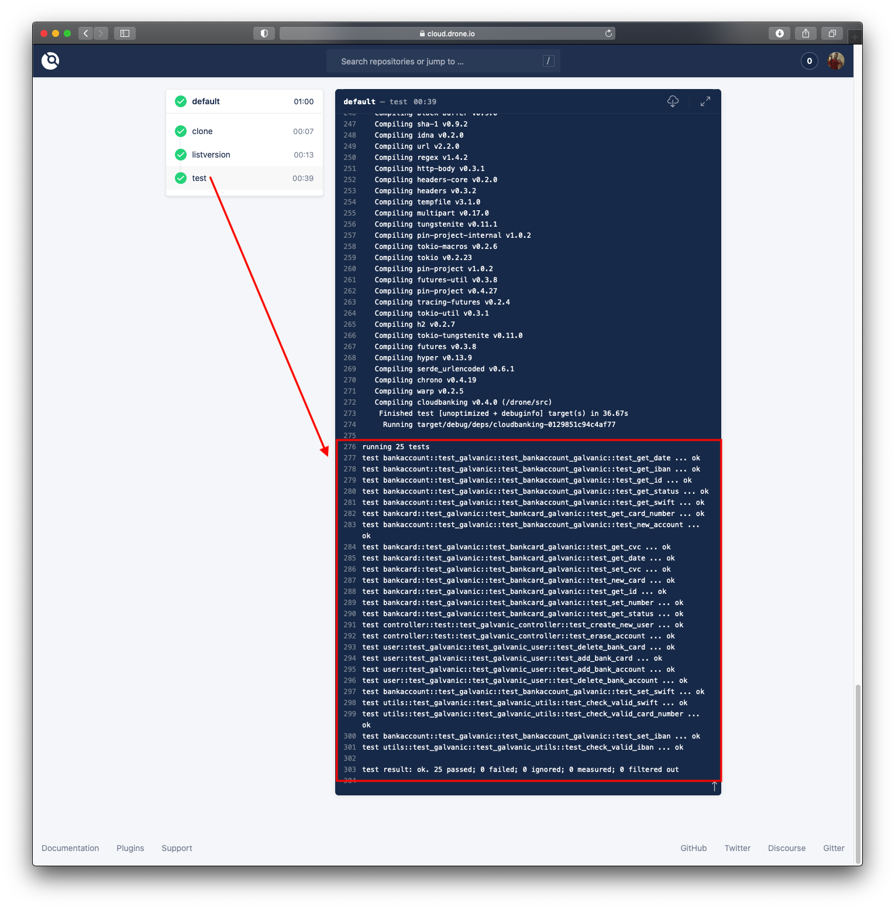


## Github Actions

We created a `workflow file` in our repository:


```yaml
name: cloudbanking proyect test (ci)

on:
  push:
    branches: 
      - 'master'
      - 'hito*'
  pull_request:
    branches: [ master ]

env:
  CARGO_TERM_COLOR: always

jobs:
  build:
    # List of possible runners 
    # https://docs.github.com/en/free-pro-team@latest/actions/reference/specifications-for-github-hosted-runners#supported-runners-and-hardware-resources
    runs-on: ubuntu-18.04

    steps:
    - uses: actions/checkout@v2
      # Smart Cache for rust
      # https://github.com/Swatinem/rust-cache
    - uses: Swatinem/rust-cache@v1
    - name: Build
      run: cargo build --verbose
    - name: Run tests
      run: cargo test -- --nocapture

```

In the file we indicate that the action will be executed in every push we make to the master branch and every push we make to the branch whose name corresponds to the regular expression 'milestone*'.
It will also respond to each pull request made on the master branch.

We define an environment variable called: *CARGO_TERM_COLOR* so that the githubaction logs come out with the colors given by the cargo manager, instead of gray. This makes it much easier to track the logs.

Later we define a job called 'build' that runs on a machine with Ubuntu 18.04. You can see the list of [available machines](https://docs.github.com/en/free-pro-team@latest/actions/reference/specifications-for-github-hosted-runners#support-runners-and-hardware-resources) along with the hardware specifications that each of them has. The justification for this choice is because it is the closest configuration to the one we have locally and the one for development.

Then we define the sequential steps to be executed in the pipeline.
First we check the code of the action to verify that it is correct.
Then the cache of the previous execution is recovered (so as not to have to download all the dependencies and compile them again).
Then the package manager and rust version is printed
At the end the tests are executed on the project.


Execution before adding cache
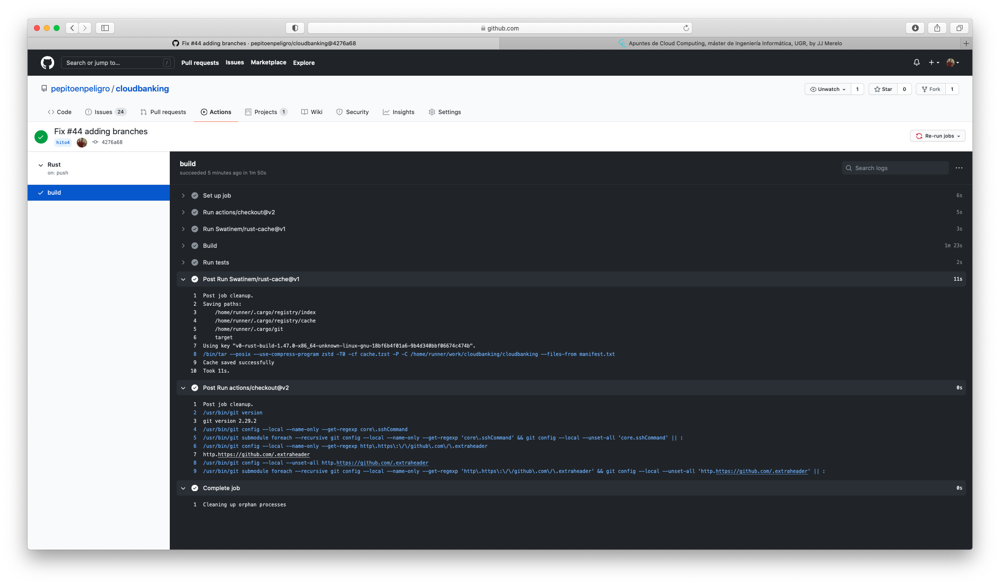

Adding cache
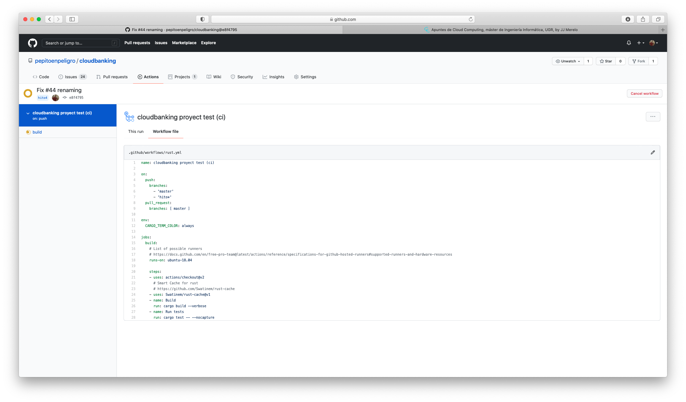


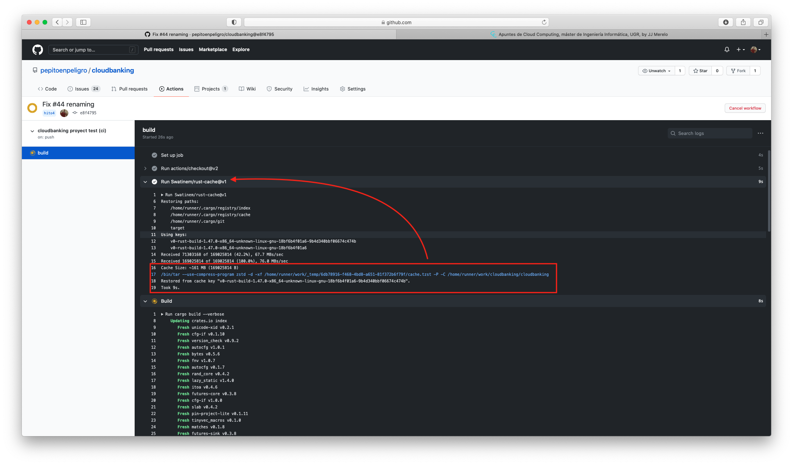
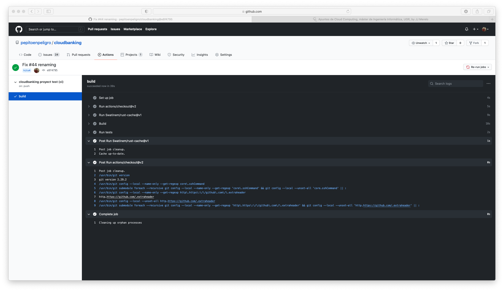


We compare the time needed to run the test. The difference is 60% faster with cache.


#### References